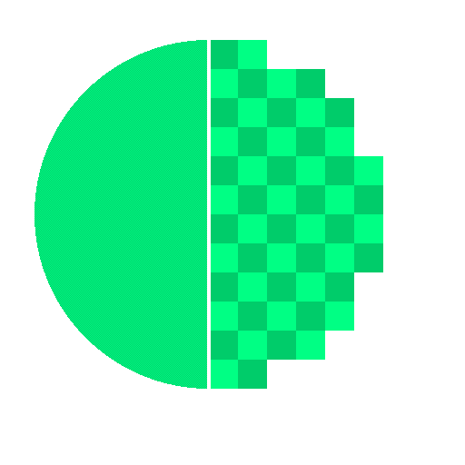
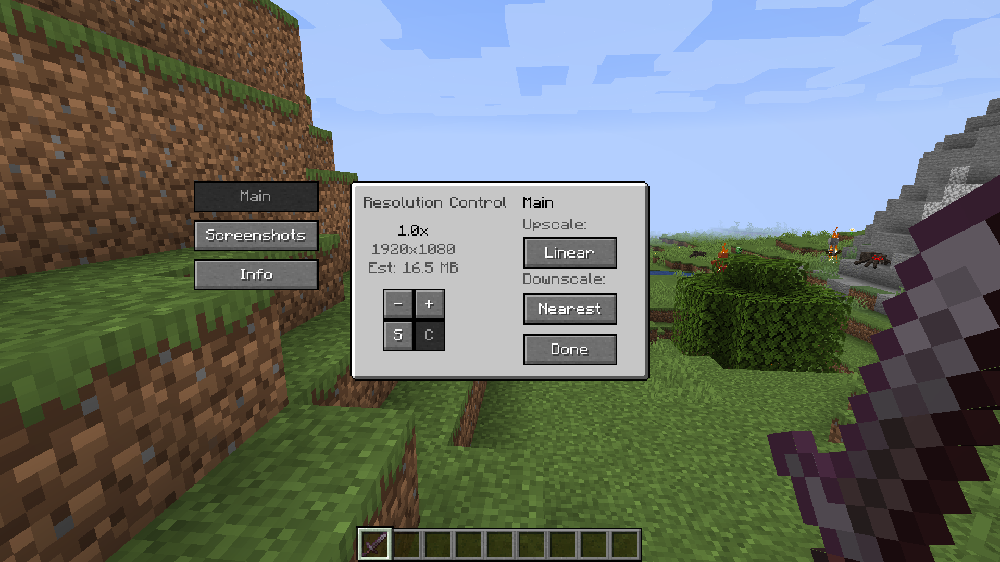

<p align="center">
	
</p>

# ResolutionControl+

ResolutionControl+ is a fork of [Resolution Control](https://github.com/juliand665/Resolution-Control)
with additional functionality.

## Features

### Resolution Scaling

ResolutionControl+ allows you to change Minecraft's render resolution separately from the HUD elements.
If you have a good GPU, you can increase the multiplier for anti-aliasing.
Otherwise, you can lower the multiplier to improve performance or give Minecraft a retro style.
You can also set a custom multiplier value by pressing the `S` button.

Additionally, you can set the upscale/downscale algorithm used to scale the render to the viewport.
Linear is useful as an anti-aliasing filter,
and nearest neighbor generally looks better for lower than native resolutions.



---

### Screenshots

ResolutionControl+ can be used to take larger than native resolution screenshots.
To do this, use the `Screenshot Framebuffer` keybind which is unbound by default.

Compared to *Fabrishot*, this implementation does not lock up the game until the screenshot is saved.
This makes taking large screenshots much faster.
And while a screenshot is being processed, you can take another one without any problems.

Here is the time it takes to take a 16k screenshot, on an i7 4770 and GTX 1060:

```
Fabrishot: 12 seconds (pause)
ResolutionControl+: <1 second (initial pause) + 13 seconds (background processing)
```

[](http://www.youtube.com/watch?v=Dghj0Ldeu0Q)

---

## Settings

**Resolution Scaling**

- Render scale
    - 0.0 - 8.0x (can be exceeded by manually setting the value)
    - An estimate VRAM usage is displayed
- Upscale/downscale algorithm  
    - Linear, nearest

**Screenshots**

- Use set size
    - Enabled: render screenshots at the specified resolution
        - Note: can produce artifacts if the screenshot aspect ratio is significantly different 
          from the aspect ratio of the viewport
    - Disabled: render at the scaled render resolution
- Always allocated
    - Enabled: screenshot framebuffer is always allocated in memory
        - May reduce screenshot pause times, at the cost of more VRAM usage during normal gameplay
    - Disabled: screenshot framebuffer is allocated on-demand and freed immediately after
- Screenshot size
    - Screenshot size if `use set size` is enabled
    - An estimate VRAM usage is displayed
    
---

## Compatibility

Currently, ResolutionControl+ **does not work with Fabulous Graphics**.

**Sodium** - Compatible

**Canvas Renderer** - Mostly compatible, lower resolutions break HUD item rendering

**Optifine** - Compatible, stacks with its own render scale implementation

